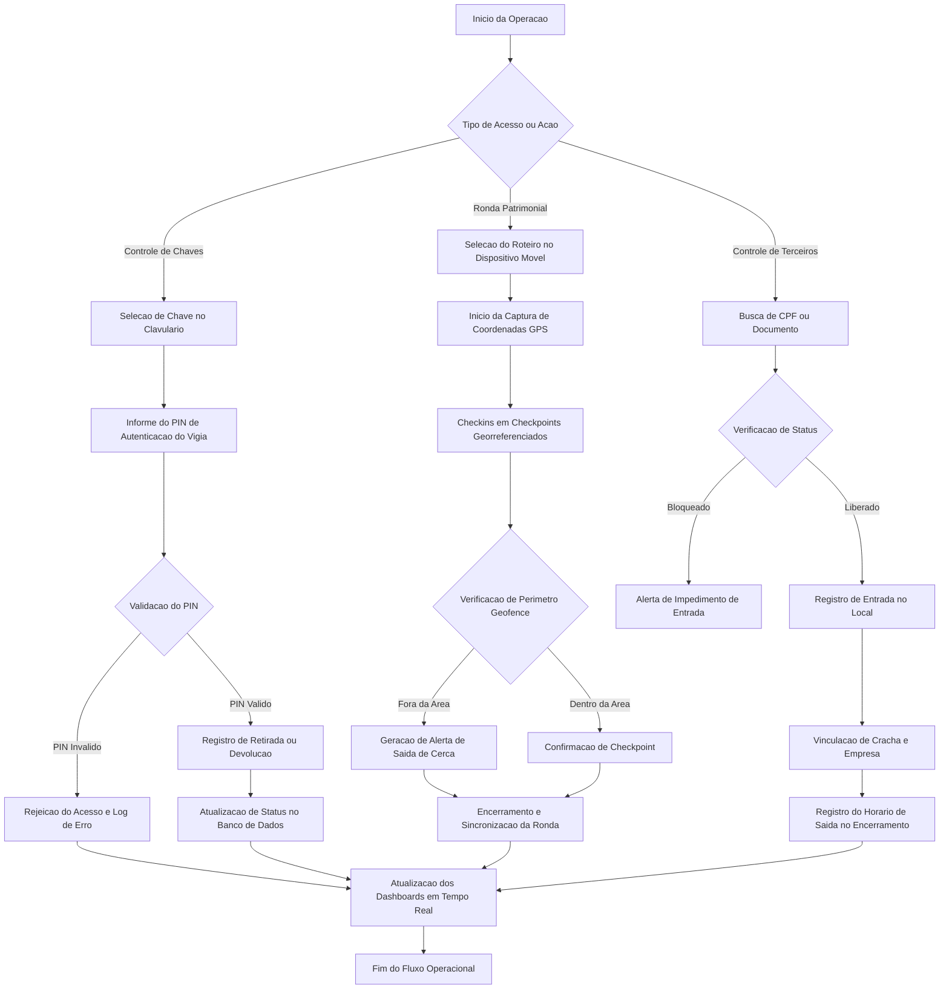
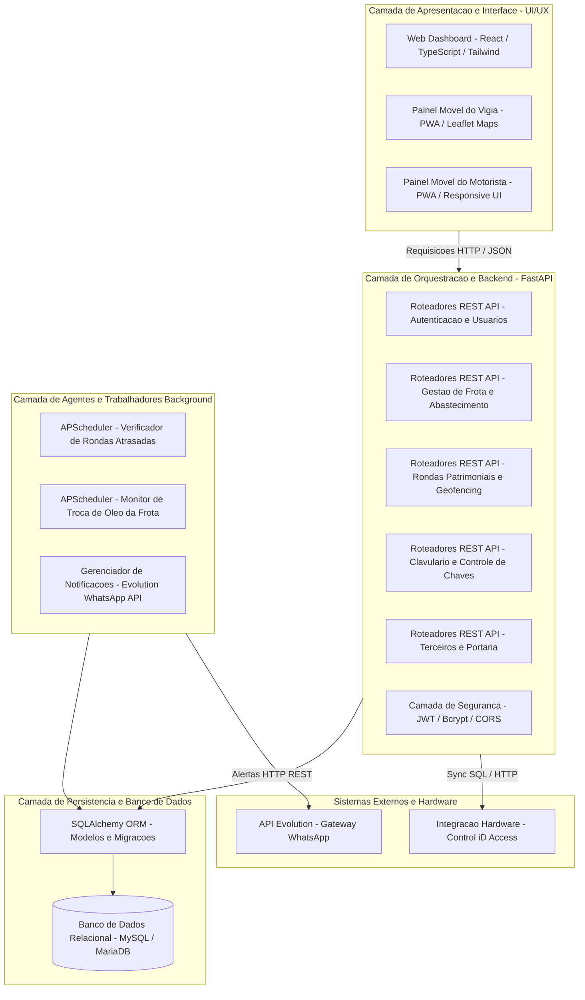
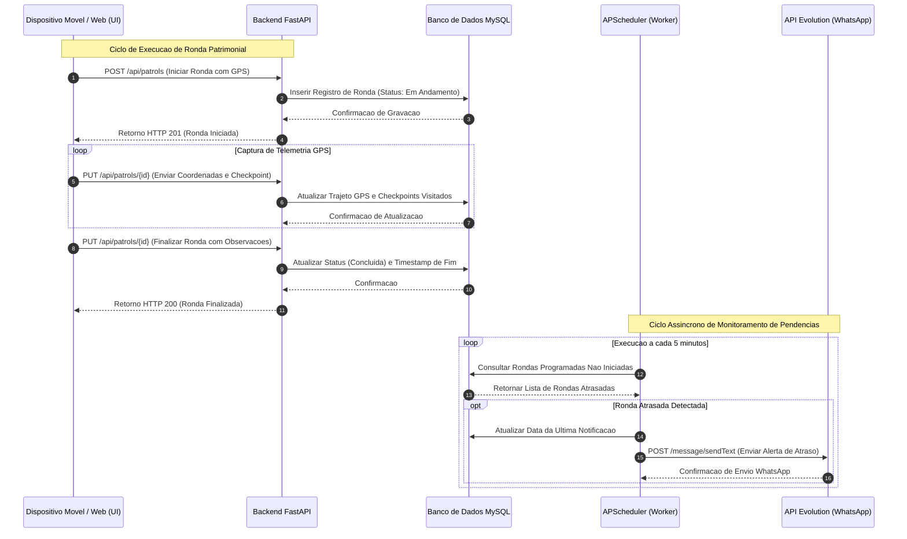
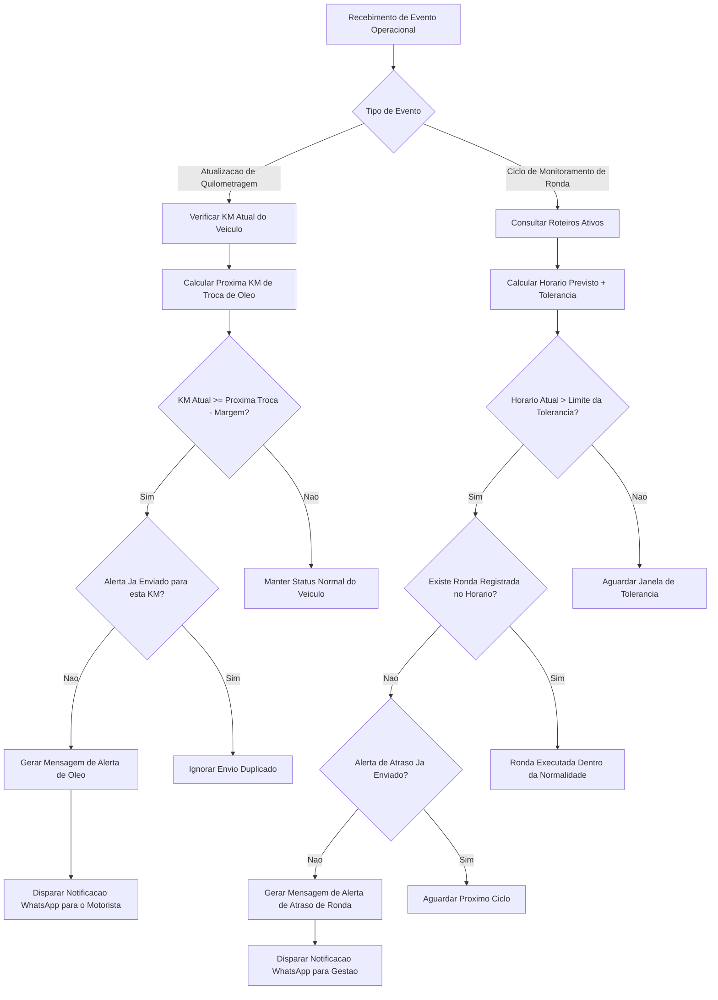
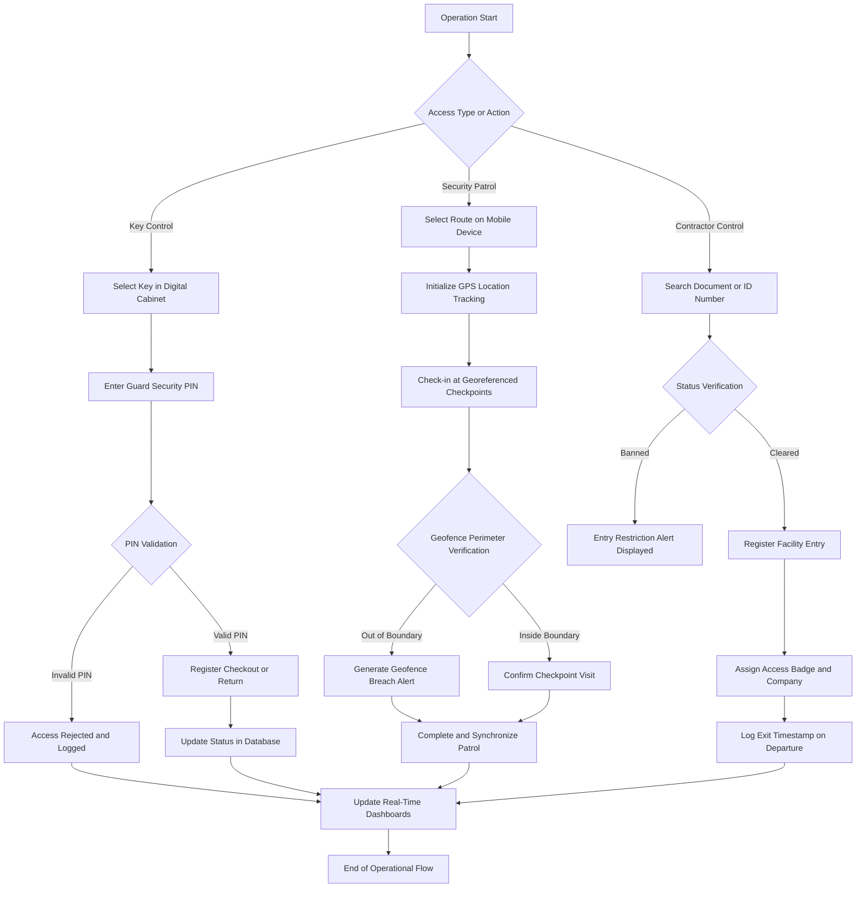
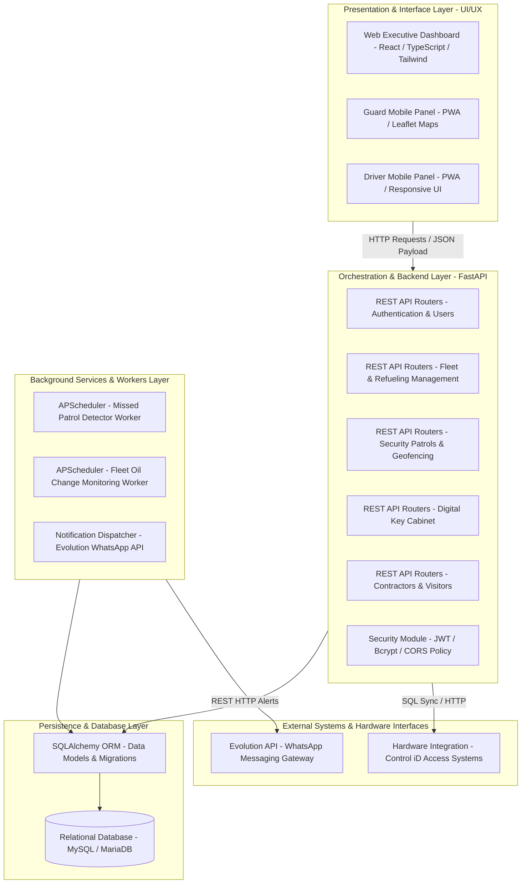
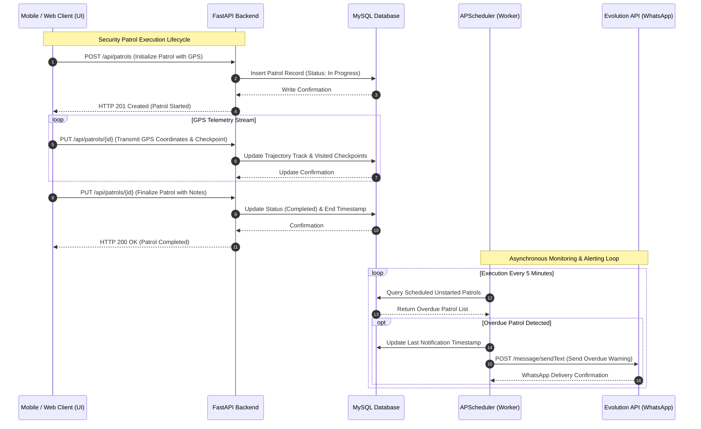
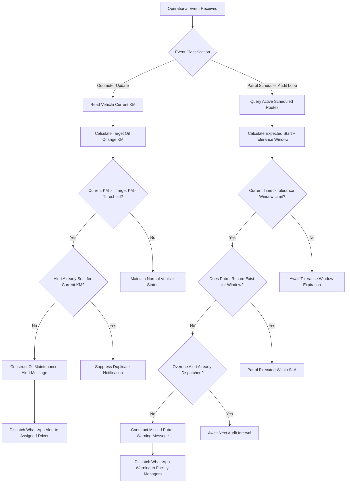

# DOCUMENTAÇÃO TÉCNICA EXECUTIVA E ARQUITETURAL
## SISTEMA INTEGRADO DE GESTÃO DE FROTA, RONDAS E CONTROLE PATRIMONIAL (FLEET CONTROL)

---

# SEÇÃO 1: DOCUMENTAÇÃO EM PORTUGUÊS DO BRASIL (PT-BR)

## 1. Visão Geral do Sistema

O Sistema de Gestão de Frota, Rondas Patrimoniais e Controle de Acesso (Fleet Control) é uma plataforma corporativa web e móvel desenvolvida para automatizar, monitorar e auditoriar operações patrimoniais críticas em tempo real. O sistema integra em uma arquitetura unificada o gerenciamento de frota veicular, controle de rondas patrimoniais baseadas em geofencing GPS, controle de portaria para terceirizados e visitantes, clavulário digital de chaves e notificações automáticas via WhatsApp.

### Propósito do Projeto
Centralizar operações que historicamente dependiam de registros manuais, planilhas dispersas e controles em papel, garantindo rastreabilidade completa, integridade de dados, conformidade operacional e rápida resposta a incidentes de segurança patrimonial ou manutenção veicular.

### Problemas Resolvidos
- Falta de auditoria na entrega e devolução de chaves da organização.
- Ausência de rastreamento em tempo real sobre cumprimento de itinerários de rondas de segurança.
- Atrasos não detectados no início de rondas preventivas.
- Falta de controle sobre a manutenção preventiva de óleo e odômetro da frota.
- Ineficiência e vulnerabilidades no cadastro e permanência de prestadores de serviço terceirizados.
- Falhas na comunicação de alertas críticos para a equipe de gestão.

---

## 2. Objetivos e Capacidades Operacionais

### Objetivos Estratégicos de Negócio
- Reduzir custos operacionais decorrentes de manutenções corretivas em veículos.
- Elevar os níveis de segurança patrimonial através do monitoramento rigoroso de rondas e cerceamento geográfico (geofencing).
- Garantir conformidade jurídica e regulatória no controle de acesso de terceiros e visitantes.
- Prover dashboards executivos e relatórios analíticos para tomada de decisão baseada em dados em tempo real.

### Capacidades Operacionais do Sistema
- **Gestão de Frota e Odômetro**: Registro de saídas, entradas, abastecimentos e cálculo automático do limite de quilometragem para troca de óleo.
- **Rondas Inteligentes com GPS e Geofencing**: Validação contínua de rotas, verificação de checkpoints georreferenciados e detecção imediata de saídas do perímetro demarcado.
- **Clavulário Digital (Controle de Chaves)**: Autenticação corporativa por código PIN do vigia para liberação e recebimento de chaves com registro de data, hora e responsável.
- **Portaria e Controle de Terceiros**: Cadastro completo de prestadores de serviço, consulta de status em tempo real (No Local, Ativo, Bloqueado) e historização de entradas e saídas.
- **Notificações Automáticas via WhatsApp**: Integração com motor de envio assíncrono para notificações de rondas atrasadas e alertas de manutenção de óleo.
- **Interface Progressiva Móvel (PWA)**: Aplicação responsiva otimizada para dispositivos móveis de vigias e motoristas com suporte a operações com conectividade intermitente.

---

## 3. Diagrama do Fluxo Operacional (End-to-End)



---

## 4. Diagrama de Arquitetura em Camadas



---

## 5. Ciclo de Vida da Execução Distribuída



---

## 6. Catálogo Completo de Componentes e Módulos

| Categoria | Módulo / Componente | Arquivo Fonte | Descrição Técnica e Responsabilidade |
| :--- | :--- | :--- | :--- |
| Backend API | Roteador de Autenticação | `backend/app/api/endpoints/auth.py` | Gestão de login, emissão de tokens JWT e controle de acesso por função. |
| Backend API | Módulo de Veículos | `backend/app/api/endpoints/vehicles.py` | Cadastro de frota, odômetro, histórico de manutenção e controle de óleo. |
| Backend API | Módulo de Motoristas | `backend/app/api/endpoints/drivers.py` | Cadastro de condutores, vínculo com veículos e validações institucionais. |
| Backend API | Módulo de Rondas | `backend/app/api/endpoints/patrols.py` | Processamento de GPS, validação de geofencing e cálculo de tolerâncias. |
| Backend API | Módulo de Roteiros | `backend/app/api/endpoints/patrol_routes.py` | Definição de pontos de checagem, cercas virtuais e horários repetitivos. |
| Backend API | Módulo de Clavulário | `backend/app/api/routers/keys.py` | Gestão do armário de chaves, histórico de retiradas e validação por PIN. |
| Backend API | Módulo de Terceiros | `backend/app/api/routers/third_party.py` | Cadastro de prestadores de serviço, consulta de impedimentos e crachás. |
| Backend API | Módulo de Visitas | `backend/app/api/routers/visits.py` | Controle de visitantes na portaria, anfitrião de destino e horários. |
| Backend API | WhatsApp Integration | `backend/app/api/endpoints/whatsapp_instances.py` | Gerenciamento de instâncias da API Evolution e status de conexão. |
| Worker | Scheduler de Tarefas | `backend/app/scheduler.py` | Agendador APScheduler para alertas de rondas atrasadas e troca de óleo. |
| Modelo DB | Modelos de Dados ORM | `backend/app/models/` | Definições de tabelas SQLAlchemy (veículos, vigias, chaves, rondas, etc). |
| Frontend | Dashboard Executivo | `frontend/src/pages/Dashboard.tsx` | Painel gráfico com KPIs, métricas de rondas, frota e alertas operacionais. |
| Frontend | Controle de Terceiros | `frontend/src/pages/control/ThirdPartyControl.tsx` | Interface de portaria com filtros avançados (No Local, Ativos, Bloqueados). |
| Frontend | Controle de Chaves | `frontend/src/pages/control/KeysControl.tsx` | Painel visual do clavulário com autenticação por senha de vigia. |
| Frontend | Módulo Movel Vigia | `frontend/src/pages/guard/GuardDashboard.tsx` | Interface PWA para execução de rondas, mapa Leaflet e check-in offline. |

---

## 7. Mecanismo de Decisão Inteligente



---

## 8. Configuração de Rede, Portas e Segurança

### Tabela de Mapeamento de Portas de Rede

| Porta | Protocolo | Serviço / Aplicação | Escopo de Acesso | Descrição de Segurança |
| :--- | :--- | :--- | :--- | :--- |
| `5011` | TCP / HTTP | FastAPI Backend Service | Interno / Proxy Reverso | Endpoint da API RESTful com autenticação JWT obrigatória. |
| `5173` | TCP / HTTP | Vite Frontend Dev Server | Ambiente de Desenvolvimento | Servidor de desenvolvimento com HMR (Hot Module Replacement). |
| `4173` | TCP / HTTP | Vite Frontend Production Preview | Interno / Proxy Reverso | Servidor de pré-visualização de build otimizado de produção. |
| `3306` | TCP / MySQL | MySQL Server | Estritamente Interno / Rede Local | Banco de dados relacional. Acesso bloqueado externamente. |
| `8080` | TCP / HTTP | Evolution API Gateway | Interno / Rede Local | Serviço gateway para integração de mensagens via WhatsApp. |

### Template Seguro de Configuração (.env)

```ini
# ===================================================================
# CONFIGURACAO DE BANCO DE DADOS MYSQL (PRODUCAO)
# ===================================================================
MYSQL_HOST=127.0.0.1
MYSQL_PORT=3306
MYSQL_USER=fleet_prod_user
MYSQL_PASSWORD=<SENHA_BANCO_DE_DADOS_SEGRA>
MYSQL_DB=fleet_control_db

# ===================================================================
# CONFIGURACAO DE SEGURANCA E AUTENTICACAO JWT
# ===================================================================
SECRET_KEY=<CHAVE_SECRETA_JWT_GERADA_ALEATORIAMENTE>
ALGORITHM=HS256
ACCESS_TOKEN_EXPIRE_MINUTES=43200

# ===================================================================
# CONFIGURACAO DE INTEGRACAO WHATSAPP EVOLUTION API
# ===================================================================
EVOLUTION_API_URL=http://127.0.0.1:8080
EVOLUTION_API_KEY=<CHAVE_API_EVOLUTION_CONFIDENCIAL>
EVOLUTION_INSTANCE_NAME=instancia_patrimonial

# ===================================================================
# CONFIGURACAO DE AGENDADOR DE TAREFAS (APSCHEDULER)
# ===================================================================
PATROL_SCHEDULER_ACTIVE=true
OIL_CHECK_INTERVAL_MINUTES=5
```

---
---

# SECTION 2: EXECUTIVE TECHNICAL DOCUMENTATION (ENGLISH)

## 1. System Overview

The Integrated Fleet Management, Security Rounds, and Access Control System (Fleet Control) is an enterprise web and mobile platform engineered to automate, monitor, and audit critical physical security and fleet operations in real time. The platform merges vehicle fleet logistics, GPS geofenced security patrol verification, contractor/visitor facility access management, digital key cabinet tracking, and automated WhatsApp alert dispatching into a unified multi-layer architecture.

### Purpose of the Project
To centralize core operational workflows that historically relied on manual logs, disconnected spreadsheets, and paper records, ensuring total traceability, data integrity, regulatory compliance, and immediate incident response capabilities.

### Problems Solved
- Absence of verifiable audit trails for organizational key borrowing and returns.
- Lack of real-time tracking for security guard patrol route compliance.
- Undetected delays in the execution of scheduled preventive rounds.
- Unmonitored vehicle oil change thresholds leading to costly engine maintenance.
- Operational inefficiencies and security risks in contractor access logs.
- Delayed critical notification delivery to facility managers.

---

## 2. Objectives and Operational Capabilities

### Strategic Business Objectives
- Decrease fleet maintenance overhead through automated odometer and oil change scheduling.
- Enhance physical asset protection via GPS geofencing and real-time route verification.
- Ensure legal and regulatory compliance regarding third-party visitor facility access.
- Provide executive dashboards and real-time telemetry for data-driven management.

### System Operational Capabilities
- **Fleet and Odometer Management**: Comprehensive logging of vehicle checkouts, check-ins, refueling entries, and automated oil service threshold calculations.
- **Intelligent Patrols with GPS Geofencing**: Continuous route tracking, georeferenced checkpoint validation, and instant perimeter breach detection.
- **Digital Key Cabinet (Key Control)**: Guard PIN-code authentication for key borrowing and returns with complete timestamped audit logging.
- **Visitor and Contractor Control**: Personnel registration, real-time status filtering (On-Site, Active, Banned), and entry/exit history tracking.
- **Automated WhatsApp Notifications**: Asynchronous background dispatch for missed patrol warnings and vehicle oil change alerts.
- **Progressive Mobile Interface (PWA)**: Responsive application optimized for mobile devices used by guards and drivers, featuring offline data buffering.

---

## 3. End-to-End Operational Flow Diagram



---

## 4. Layered Architecture Diagram



---

## 5. Distributed Execution Lifecycle



---

## 6. Complete Catalog of Components and Modules

| Category | Module / Component | Source File | Technical Description & Scope |
| :--- | :--- | :--- | :--- |
| Backend API | Auth Router | `backend/app/api/endpoints/auth.py` | Handles user authentication, JWT issuance, password hashing, and role checks. |
| Backend API | Vehicles Module | `backend/app/api/endpoints/vehicles.py` | Manages fleet registration, odometer readings, maintenance, and oil change metrics. |
| Backend API | Drivers Module | `backend/app/api/endpoints/drivers.py` | Drivers management, vehicle bindings, and credentials validation. |
| Backend API | Patrols Module | `backend/app/api/endpoints/patrols.py` | Ingests GPS tracks, validates geofences, and handles patrol completion logic. |
| Backend API | Patrol Routes Module | `backend/app/api/endpoints/patrol_routes.py` | Route definition, geofence coordinate storage, and recurring schedule setups. |
| Backend API | Key Cabinet Module | `backend/app/api/routers/keys.py` | Key registry, checkout/return logs, and security guard PIN validation. |
| Backend API | Third-Party Module | `backend/app/api/routers/third_party.py` | Contractor profiles, active/banned status queries, and access logs. |
| Backend API | Visits Module | `backend/app/api/routers/visits.py` | Visitor registry, host designation, entry/exit timestamp management. |
| Backend API | WhatsApp Integration | `backend/app/api/endpoints/whatsapp_instances.py` | Evolution API instance configuration and connection status monitoring. |
| Worker | Job Scheduler | `backend/app/scheduler.py` | APScheduler background service checking overdue patrols and oil service triggers. |
| DB Model | ORM Schemas | `backend/app/models/` | SQLAlchemy relational definitions (vehicles, guards, keys, patrols, visits). |
| Frontend | Executive Dashboard | `frontend/src/pages/Dashboard.tsx` | Analytics portal presenting KPIs, patrol charts, fleet status, and alerts. |
| Frontend | Contractor Control | `frontend/src/pages/control/ThirdPartyControl.tsx` | Facility gate panel with real-time status filtering (On-Site, Active, Banned). |
| Frontend | Key Control | `frontend/src/pages/control/KeysControl.tsx` | Visual key cabinet board requiring guard PIN entry for checkouts. |
| Frontend | Guard Mobile PWA | `frontend/src/pages/guard/GuardDashboard.tsx` | PWA interface for field security guards, Leaflet maps, and offline syncing. |

---

## 7. Intelligent Decision Mechanism



---

## 8. Network, Ports, and Security Configuration

### Network Port Mapping Matrix

| Port | Protocol | Service / Component | Access Scope | Security & Isolation Details |
| :--- | :--- | :--- | :--- | :--- |
| `5011` | TCP / HTTP | FastAPI Backend Service | Internal / Reverse Proxy | Core RESTful API endpoint enforcing mandatory JWT authorization. |
| `5173` | TCP / HTTP | Vite Frontend Dev Server | Development Host Only | Dev server providing Hot Module Replacement (HMR). |
| `4173` | TCP / HTTP | Vite Production Preview | Internal / Reverse Proxy | Optimized production build static preview server. |
| `3306` | TCP / MySQL | MySQL Database Engine | Strictly Internal / LAN | Relational database server. External direct access prohibited. |
| `8080` | TCP / HTTP | Evolution API Gateway | Internal / LAN | Gateway endpoint for automated WhatsApp notification dispatches. |

### Secure Production Configuration Template (.env)

```ini
# ===================================================================
# MYSQL PRODUCTION DATABASE CONFIGURATION
# ===================================================================
MYSQL_HOST=127.0.0.1
MYSQL_PORT=3306
MYSQL_USER=fleet_prod_user
MYSQL_PASSWORD=<SECURE_DATABASE_PASSWORD>
MYSQL_DB=fleet_control_db

# ===================================================================
# JWT SECURITY AND AUTHENTICATION CONFIGURATION
# ===================================================================
SECRET_KEY=<RANDOM_GENERATED_SECURE_JWT_SECRET>
ALGORITHM=HS256
ACCESS_TOKEN_EXPIRE_MINUTES=43200

# ===================================================================
# WHATSAPP EVOLUTION API INTEGRATION CONFIGURATION
# ===================================================================
EVOLUTION_API_URL=http://127.0.0.1:8080
EVOLUTION_API_KEY=<CONFIDENTIAL_EVOLUTION_API_KEY>
EVOLUTION_INSTANCE_NAME=patrol_instance

# ===================================================================
# APSCHEDULER WORKER TASK CONFIGURATION
# ===================================================================
PATROL_SCHEDULER_ACTIVE=true
OIL_CHECK_INTERVAL_MINUTES=5
```
